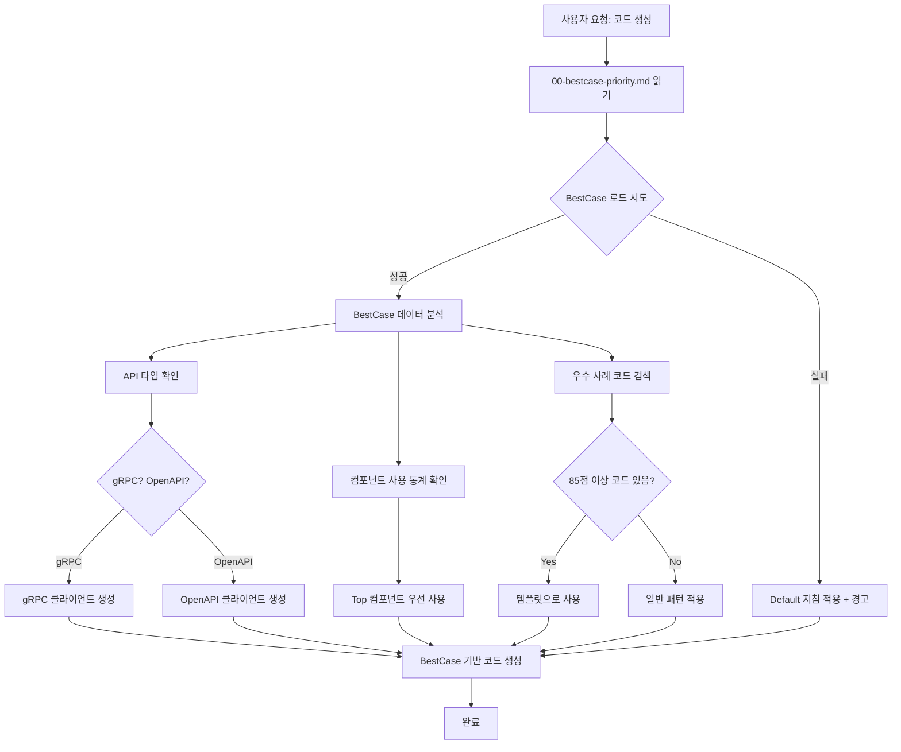
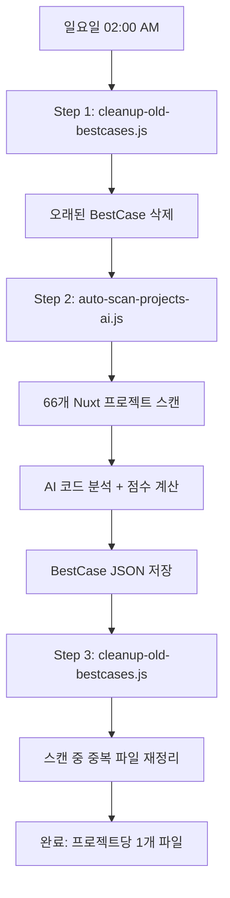

# 주요 변경 사항 요약

## 📅 2025-01-07 업데이트

### 🎯 핵심 문제 해결

**문제 인식:** 
사용자 첨부 이미지에서 AI가 default 지침만 참고하고, 실제 작업 중인 프로젝트의 BestCase(gRPC/OpenAPI 정보)를 활용하지 못하는 문제 발견

**해결 방안:**
1. BestCase 우선 참조 규칙 수립
2. MCP 기반 자동 BestCase 로드 워크플로우 구현
3. 모든 프로젝트에 공통 적용 가능한 지침 작성

---

## 📝 새로 작성된 지침 파일

### 1. `00-bestcase-priority.md` (최우선 규칙) ⭐ NEW

**목적:** 모든 프로젝트에서 BestCase를 우선 참조하도록 강제

**핵심 내용:**
- ✅ 작업 시작 전 `list_bestcases()` → `load_bestcase()` 필수
- ✅ BestCase의 API 타입, 컴포넌트 패턴 우선 적용
- ✅ Default 지침과 충돌 시 **BestCase 우선**
- ❌ API 타입 추측 금지 (반드시 BestCase 확인)

**적용 방식:**
```yaml
---
applyTo: "**/*"
priority: 1
---
```

**헬퍼 함수 제공:**
- `findMatchingBestCase()`: 현재 워크스페이스와 BestCase 매칭
- `loadCurrentProjectBestCase()`: BestCase 로드 및 검증

### 2. `bestcase-usage.md` (상세 가이드) 🔄 UPDATED

**변경 사항:**
- ❌ 기존: "BestCase는 감지만 하며, 자동 설정은 하지 않습니다" (수동 가이드)
- ✅ 신규: "MCP를 통해 자동으로 BestCase 로드 및 코드 생성" (자동화 가이드)

**새로 추가된 섹션:**
1. **Step 1: 현재 프로젝트 BestCase 자동 로드**
   - MCP 함수 호출 시퀀스
   - 프로젝트 매칭 로직

2. **Step 2: API 타입 자동 감지 및 적용**
   - gRPC/OpenAPI/하이브리드 자동 판단
   - BestCase 기반 클라이언트 생성

3. **Step 3: 컴포넌트 패턴 자동 적용**
   - 사용 빈도 통계 기반 컴포넌트 선택
   - Top 5 컴포넌트 우선 사용

4. **Step 4: 우수 사례 코드 자동 참조**
   - 85점 이상 코드 필터링
   - 템플릿으로 활용

**실전 시나리오:**
- 시나리오 1: 새 페이지 생성 (목록 페이지)
- 시나리오 2: API 클라이언트 생성
- 시나리오 3: 데이터 포맷팅

**체크리스트 제공:**
- [ ] BestCase 조회했는가?
- [ ] API 타입 확인했는가?
- [ ] 컴포넌트 패턴 확인했는가?
- [ ] 우수 사례 참고했는가?
- [ ] BestCase 우선 원칙 준수했는가?

---

## 🔄 작동 원리

### Before (문제 상황)

```typescript
// ❌ AI가 Default 지침만 참고
User: "상품 목록 페이지 만들어줘"

AI: [default.instructions.md만 읽음]
     "이 프로젝트는 gRPC를 사용합니다" (틀림!)
     → gRPC 클라이언트 생성 (OpenAPI 프로젝트인데!)
```

### After (해결 방안)

```typescript
// ✅ AI가 BestCase 우선 참조
User: "상품 목록 페이지 만들어줘"

AI: [00-bestcase-priority.md 읽음]
    Step 1: list_bestcases() 호출
    Step 2: 현재 프로젝트 매칭 (50.dktechin/frontend)
    Step 3: load_bestcase("50.dktechin/frontend", "auto-scan-ai")
    Step 4: BestCase 확인
      - apiType: "OpenAPI" ✅
      - componentUsage: { CommonPaginationTable: 15, CommonTable: 3 }
      - excellentSnippets: [{ file: "composables/api.ts", score: 88 }]
    
    Step 5: BestCase 기반 코드 생성
      - OpenAPI 클라이언트 사용
      - CommonPaginationTable 사용 (가장 많이 쓰임)
      - composables/api.ts 우수 사례 참고
```

---

## 📊 BestCase 자동 활용 흐름도



---

**문제**: "프로젝트별 한개의 최신 AI 분석 결과만 있으면 될 거 같아"

**해결 방법**:
1. **새 스크립트 생성**: `cleanup-old-bestcases.js`
   - 프로젝트별 BestCase 파일 그룹화
   - 타임스탬프 기준 정렬
   - 최신 파일만 유지, 나머지 삭제

2. **테스트 결과**:
   ```
   Before: 116 files (프로젝트당 2개씩)
   After:  66 files (프로젝트당 1개씩)
   Deleted: 50 duplicate files
   ```

3. **자동화 적용**:
   - `cron-scan.sh`에 3단계 프로세스 추가
   - **Step 1**: 오래된 파일 정리
   - **Step 2**: AI 스캔 실행
   - **Step 3**: 스캔 후 재정리

### 3. ⏰ 스캔 주기 변경

**문제**: "주기도 매주 일요일에 체크만 하는식으로 변경해 줘"

**변경 내용**:
- **Before**: `0 */6 * * *` (6시간마다)
- **After**: `0 2 * * 0` (매주 일요일 오전 2시)

**영향**:
- 리소스 사용량 감소: 주 28회 → 주 1회
- GPU 활용 최적화: 한 번에 집중 처리
- 스캔 시간: 약 2-4시간 (일요일 새벽)

## 📊 전체 프로세스 흐름

### 주간 스캔 (Every Sunday 02:00)



### BestCase 저장 구조

```
/projects/.bestcases/
├── 00.common-frontend_work-dir-auto-scan-ai-1762524673559.json
├── 14.dream2m-frontend-admin-auto-scan-ai-1762527767113.json
├── 50.dktechin-frontend-auto-scan-ai-1762537863463.json
└── ... (총 66개, 프로젝트당 1개)
```

## 🔧 기술 세부사항

### 환경 변수

```env
BESTCASE_STORAGE_PATH=/projects/.bestcases
LLM_MODEL=qwen2.5-coder:7b
CONCURRENCY=2
```

### Docker 설정

```yaml
cron-scheduler:
  cron: '0 2 * * 0'  # Every Sunday 02:00 AM
  scripts:
    - cleanup-old-bestcases.js
    - cron-scan.sh (auto-scan-projects-ai.js)
```

### 파일 정리 로직

```javascript
// cleanup-old-bestcases.js
1. BestCase 파일 전체 읽기
2. 프로젝트명별로 그룹화
3. 타임스탬프 기준 정렬
4. 각 프로젝트별 최신 1개만 유지
5. 나머지 파일 삭제
```

## 📚 관련 문서

| 문서 | 설명 |
|------|------|
| [WEEKLY_SCAN_GUIDE.md](./WEEKLY_SCAN_GUIDE.md) | 주간 스캔 상세 가이드 |
| [bestcase-usage.md](./.github/instructions/bestcase-usage.md) | BestCase 활용 방법 |
| [AI_AUTO_SCAN_GUIDE.md](./AI_AUTO_SCAN_GUIDE.md) | AI 분석 상세 설명 |
| [VSCODE_MCP_GUIDE.md](./VSCODE_MCP_GUIDE.md) | VS Code MCP 연동 |

## ✅ 완료된 작업

- [x] BestCase 자동 연결 가능성 검토
- [x] MCP 한계 파악 및 문서화
- [x] BestCase 활용 가이드 작성 (200+ 줄)
- [x] cleanup-old-bestcases.js 생성
- [x] 로컬 테스트 (116 → 66 파일)
- [x] Cron 스케줄 변경 (6시간 → 주간)
- [x] 3단계 스캔 프로세스 구현
- [x] Docker 이미지 재빌드
- [x] Cron 스케줄러 재시작
- [x] 컨테이너 내부 테스트 완료
- [x] 주간 스캔 가이드 작성
- [x] README.md 업데이트

## 🎯 다음 실행 예정

**다음 스캔**: 다가오는 일요일 오전 2시

확인 방법:
```bash
docker exec bestcase-cron-scheduler crontab -l
# 출력: 0 2 * * 0 /app/cron-scan.sh >> /var/log/cron.log 2>&1
```

수동 실행 (테스트):
```bash
docker exec -it bestcase-cron-scheduler /app/cron-scan.sh
```
